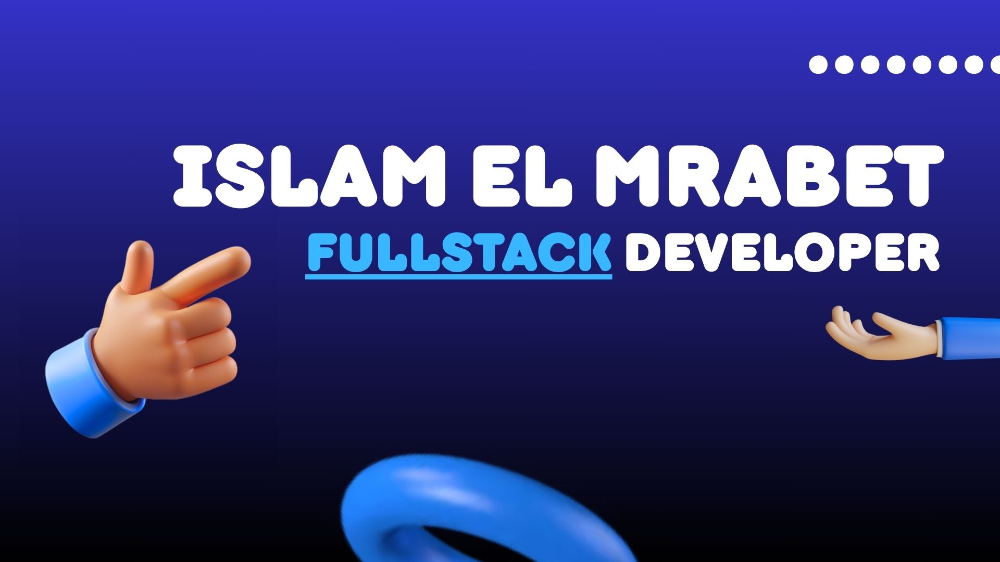

<h1 align="center">¡Hola, soy @IslamReact! 👋</h1>

## Acerca de mí
Soy un entusiasta del desarrollo de software con un amplio interés que abarca desde la programación en Java y Kotlin hasta el desarrollo de aplicaciones. Siempre estoy explorando nuevas tecnologías y buscando enriquecer mis conocimientos en el vasto mundo del desarrollo de software.

Lenguajes que domino:
<!-- Lenguajes -->

<!-- Frameworks / Otros -->

## Aprendizaje constante
Actualmente, estoy inmerso en el aprendizaje de Kotlin y consolidando mis habilidades en Java. La versatilidad de ambos lenguajes me permite abordar proyectos desafiantes y seguir expandiendo mi conjunto de habilidades.

## Mis estadíticas

## Colaboración y Proyectos
Estoy emocionado con la idea de colaborar en proyectos innovadores que involucren tanto a Kotlin como a Java. Creo en la sinergia de estas tecnologías para crear soluciones robustas y eficientes. Si tienes un proyecto interesante, ¡me encantaría contribuir!

## Conéctate conmigo
- 💼 LinkedIn: [Islam](https://www.linkedin.com/in/islam-el-mrabet-larhzaoui-b0441629a/)
- 📧 Correo Electrónico: islamelmrabet04@gmail.com

---

  
  &nbsp;&nbsp;&nbsp;
  

<!---
IslamReact/IslamReact is a ✨ special ✨ repository because its `README.md` (this file) appears on your GitHub profile.
You can click the Preview link to take a look at your changes.
--->
